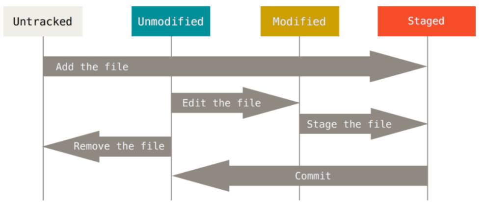

本章讲述Git的基础知识。  

## Git基础
### 获取Git Repo
有两种获取Git Repo的方法  
* 将本地未纳入版本控制的目录转变为Git repo  
* 从其他地方克隆Git repo  

#### 在已存在的目录中初始化Repo
在已存在的目录中输入
`$ git init`  
即可。  

该命令会在目录中创建一个`.git`的子目录，其中包含了所有必要的repo文件。此时，工程中没有任何文件被追踪。  

如果想要开始对已存在的文件进行版本控制，可以输入下面命令  
```
$ git add *.c
$ git add LICENSE
$ git commit -m "initial project version"
```

#### 克隆已存在的Repo
`git clone`可以用来克隆已存在的文件。与其他版本控制系统常用的`checkout`不同，这里的`clone`表示Git会把已存在Repo中所有的文件的所有版本都克隆到本地，而不是只拷贝当前版本的文件。  

通过`git clone <url>`可以克隆repo。例如：  
`$ git clone https://github.com/libgit2/libgit2`  
创建了一个名叫`libgit2`的目录，在其中初始化了`.git`目录，将该库的数据都拉到其中，并签出(`checkout`)了最新版本的文件。  

### 记录Repo的变化
每个工作目录中的文件有两个状态：*tracked*或是*untracked*。*tracked*的文件是在上一个快照中的文件；它们可以是未修改的(`unmodified`)，修改的(`modified`)和暂存的(`staged`)。  

几个状态之间的转移图如图所示。  


#### 检查文件状态
`git status`可用来检查文件的状态。  

例如，假设刚刚`clone`了一个repo，则此时使用`git status`命令一般显示如下  
```
$ git status
On branch master
Your branch is up-to-date with 'origin/master'.
nothing to commit, working directory clean
```

这表明工作目录是干净的，即你所跟踪(`track`)的文件都没有被修改  

如果添加一个`README`文件，则它是一个`untracked`文件，目录的状态就发生了变化  
```
$ echo 'My Project' > README
$ git status
On branch master
Your branch is up-to-date with 'origin/master'.
Untracked files:
(use "git add <file>..." to include in what will be committed)
README
nothing added to commit but untracked files present (use "git add" to track)
```

`untracked`文件表示该文件没有出现在上一次`commit`的快照中  

#### 跟踪新文件
可通过`git add`命令跟踪新文件。例如  
`git add README`  

此时运行`git status`命令，则输出为  
```
$ git status
On branch master
Your branch is up-to-date with 'origin/master'.
Changes to be committed:
  (use "git reset HEAD <file>..." to unstage)

    new file:  README
```
现在该文件就处于暂存(`staged`)状态了。该状态下对文件的改变等待被`commit`。  

#### 暂存修改后文件
如果修改了一个之前跟踪的文件，例如`CONTRIBUTING.md`，然后运行`git status`,则输出为  
```
$ git status
On branch master
Your branch is up-to-date with 'origin/master'.
Changes to be committed:
  (use "git reset HEAD <file>..." to unstage)
    new file:  README
Changes not staged for commit:
  (use "git add <file>..." to update what will be committed)
  (use "git checkout -- <file>..." to discard changes in working directory)
    modified:  CONTRIBUTING.md
```

`CONTRIBUTING.md`文件被修改了，但还没有位于暂存区中，需要通过`git add`命令将其加入暂存区。  

运行`git add`命令后状态如下  
```
$ git add CONTRIBUTING.md
$ git status
On branch master
Your branch is up-to-date with 'origin/master'.
Changes to be committed:
  (use "git reset HEAD <file>..." to unstage)
    new file: README
    modified: CONTRIBUTING.md
```
如果此时调用`commit`，则两个文件都会被加入快照中。如果此时你修改了`CONTRIBUTING.md`文件，则`git status`命令的输出会是  
```
$ vim CONTRIBUTING.md
$ git status
On branch master
Your branch is up-to-date with 'origin/master'.
Changes to be committed:
  (use "git reset HEAD <file>..." to unstage)
    new file: README
    modified: CONTRIBUTING.md

Changes not staged for commit:
 (use "git add <file>..." to update what will be committed)
 (use "git checkout -- <file>..." to discard changes in working directory)
    modified: CONTRIBUTING.md
```
`CONTRIBUTING.md`既是`staged`又是`unstaged`。`staged`的文件是上一次`git add`加进去的，而后面修改内容的文件处于`unstaged`状态。如果现在`commit`，则快照中的文件仍然是修改之前的，即`staged`状态的文件。  

#### 忽略文件
Git可通过在`.gitignore`文件中设置对应的语法规则来使得Git在添加、提交等操作时忽略一些文件，例如程序构建后的文件、构建过程中的目标文件、临时文件等。其中的语法这里不再详细介绍，当用到时去查看即可。  

#### 观看暂存以及未暂存的改变
`git status`命令的输出太模糊、宽泛了——你知道文件的状态，但不知道文件的内容发生了什么变化。`git diff`命令可用于观看这些变化。  

例如，假设你编辑并且暂存了`README`文件，编辑了`CONTRIBUTING.md`文件但没有暂存它，则`git status`的输出是  
```
$ git status
On branch master
Your branch is up-to-date with 'origin/master'.
Changes to be committed:
 (use "git reset HEAD <file>..." to unstage)
    modified: README
Changes not staged for commit:
 (use "git add <file>..." to update what will be committed)
 (use "git checkout -- <file>..." to discard changes in working directory)
    modified: CONTRIBUTING.md
```
为了观看改变的但是没有暂存的内容，直接输入`git diff`  
```
$ git diff
diff --git a/CONTRIBUTING.md b/CONTRIBUTING.md
index 8ebb991..643e24f 100644
--- a/CONTRIBUTING.md
+++ b/CONTRIBUTING.md
@@ -65,7 +65,8 @@ branch directly, things can get messy.
 Please include a nice description of your changes when you submit your PR;if we have to read the whole diff to figure out why you're contributing in the first place, you're less likely to get feedback and have your change
-merged in.
+merged in. Also, split your changes into comprehensive +chunks if your patch is longer than a dozen lines.

If you are starting to work on a particular area, feel free to submit a PR that highlights your work in progress (and note in the PR title that it's
```

该命令比较工作目录和暂存区的差异。因此结果就是告诉你你所改变的没有暂存的内容。  

如果想看已经暂存的(即将要进入下一次`commit`中的)内容，可以使用`git diff --staged`。该命令比较暂存区和上一次`commit`的内容的变化  
```
$ git diff --staged
diff --git a/README b/README
new file mode 100644
index 0000000..03902a1
--- /dev/null
+++ b/README
@@ -0,0 +1 @@
+My Project
```

#### 提交发生的改变
`commit`命令可以将暂存区中的内容加入到快照当中。`git commit`命令会打开默认编辑器让你键入`commit`的相关信息。也可以通过`git commit -m <message>`来输入信息。  

记住，只有暂存区的内容会加入快照当中，不在暂存区的修改都会是`modified`状态。`commit`命令的本质是创建一个暂存区的快照。  

#### 跳过暂存区
通过给`git commit`命令传递`-a`选项可以使其跳过暂存阶段。该选项会将所有跟踪的改变内容的文件暂存(注意：未跟踪的文件不会被暂存！)  

#### 删除文件
为了从Git中删除文件，需要删除跟踪着的文件然后`commit`。`git rm`会删除跟踪着的文件。工作目录中的对应文件也会被删除。  

如果只是使用`rm`命令删除，则该改变使得Git进入下面的状态  
```
$ rm PROJECTS.md
$ git status
On branch master
Your branch is up-to-date with 'origin/master'.
Changes not staged for commit:
 (use "git add/rm <file>..." to update what will be committed)
 (use "git checkout -- <file>..." to discard changes in working directory)
    deleted: PROJECTS.md
no changes added to commit (use "git add" and/or "git commit -a")
```
如果使用`git rm`命令，则对应的文件会从暂存区中删除  
```
$ git rm PROJECTS.md
rm 'PROJECTS.md'
$ git status
On branch master
Your branch is up-to-date with 'origin/master'.
Changes to be committed:
 (use "git reset HEAD <file>..." to unstage)
    deleted: PROJECTS.md
```
接着`commit`即可。如果对文件进行了修改(处于`modified`状态，未加入暂存区)或已经将它加入暂存区(没有`commit`)，则需要加上`-f`选项强制删除。  

有时候或许只想从暂存区中删除文件，而希望在硬盘上保留它。也就是说，希望Git不再跟踪该文件，则可以给`git rm`命令加上`--cached`选项。  

#### 移动文件
Git不显式跟踪文件的移动。  

```
$ git mv README.md README
$ git status
On branch master
Your branch is up-to-date with 'origin/master'.
Changes to be committed:
 (use "git reset HEAD <file>..." to unstage)
    renamed: README.md -> README
```

上面的命令和下面的命令是等价的  
```
$ mv README.md README
$ git rm README.md
$ git add README
```