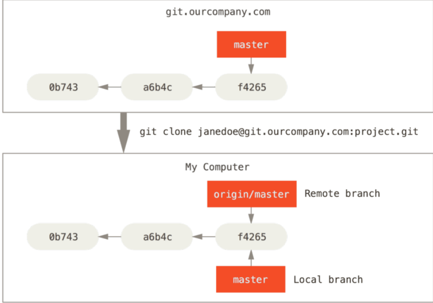
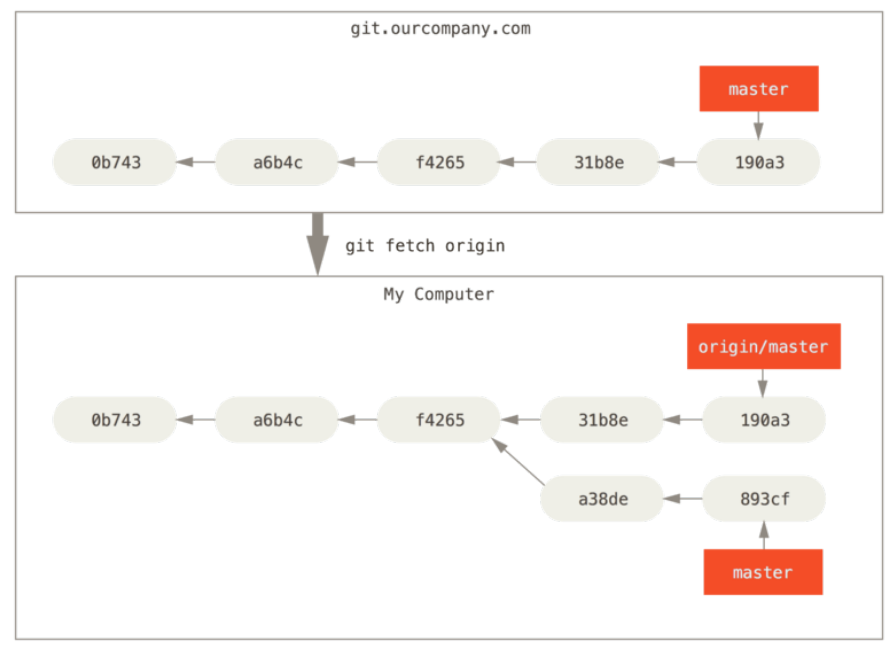

本周把有关分支的部分结束。  

## Branch Management
`git branch -v`可以显示所有分支以及所有分支的最后一次提交的信息。  

`git branch --merged`可以显示当前分支和已经合并到当前分支的分支。已经合并到当前分支的分支则可以安全的删除。  

`git branch --no-merged`会显示当前分支和还没合并的分支。删除还没合并的分支会报错，除非强制删除。  

## Branching workflows
### Long-Running Branches
一种工作流是维护一个稳定的master分支，开出其他分支用于开发或测试。当其他分支经测试稳定之后，再将该分支并入稳定的分支中。  

可以开出多个分支，每一个分支表示不同的稳定性。当一个分支的稳定性达到一定程度则将它并入另一分支即可。  

### Topic Branches
另一种很常见的工作流是主题相关工作流。当你工作在master上时，对于要修复的bug、要添加的特性等都可以新开一个分支，在该分支上进行与这些内容相关的工作，当工作完成后则合并入master分支即可。  

## Remote Branches
远程跟踪分支是指向远程分支状态的指针。它们是不能自主移动的本地指针。只有在你从远程分支中fetch或是pull（与远程分支取得联系）时，它们才会与远程分支进行同步。  

远程跟踪分支的名字是`<remote>/<branch>`,例如`<origin>/<master>`。  

下面还是用例子来说明。例如在你的网络`git.ourcompany.com`中有一个git server。你从它`clone`后，Git会自动为你将该server取名为`origin`，将它的数据拉下来，创造一个指向它的`master`分支的指针并将其命名为`origin/master`。此外，Git还会给你本地的`master`分支。  

 

假如你在本地做了一些工作，同时其他人远程提交了一些工作，则此时你们进程不同。但由于你没有与远程主机联系，因此你并不知情。  


假设你进行了fetch(`git fetch origin`),则示意图如下。  



### Pushing
可以利用`git push <remote> <branch>`命令推送自己的代码。例如，你有一个`serverfix`分支要推送，则命令为`git push origin serverfix`。  

这里Git将该命令进行了展开。它会把`serverfix`分支名扩展为`refs/heads/serverfix:refs/heads/serverfix`。它的意思是“推送我的本地serverfix分支以更新远程的serverfix分支”。在命令中也可以简写为`git push origin serverfix:serverfix`。如果本地分支与远程分支不同也可以，命令为`git push origin <local_branch>:<remote_branch>`。  

要注意的是如果你`git fetch <remote>`获得新的远程跟踪分支，你不能获得在本地获得可编辑的分支的拷贝，你只是有一个`<remote>/<branch>`的不可修改的指针而已。你可以利用`git merge`把该分支合并到自己的分支，也可以利用`git checkout -b <local_branch> <remote>/<branch>`来获得本地的对应分支。  

### Tracking Branches
从远程跟踪分支签出一个本地分支会自动创建一个“跟踪分支”（tracking branch）。跟踪分支是和远程分支有直接关系的本地分支。如果你在一个跟踪分支中并且输入`git pull`，Git会自动知道从哪个server fetch以及要合并到哪个分支。  

当你克隆一个库，它会自动创建一个`master`分支跟踪`origin/master`。然而，你也可以设置其他的跟踪分支——跟踪其他remote的分支，或者不跟踪master的分支。一个简单的例子是刚刚看到的`git checkout -b <branch> <remote>/<branch>`。  

可以用`git branch`的`-vv`选项来看所有的分支分别跟踪的是哪个远程分支以及你的本地分支是落后还是超前。  

要注意的是，落后和超前的数字是从你上次从各个server处fetch时开始算起的。该命令不会与远程server取得联系。  

### Deleting Remote Branches
可以通过`git push`的`--delete`选项删除某个远程分支。这其实只是在远程删除了某个指针。真正的删除会在某个时候垃圾回收时进行。因此短时间内的恢复是很容易的。  

## Rebasing
### The Basic Rebase
Rebase是Git中另一种将变化从一个分支集成到另一个分支的方法（还有一个是merge）。  

例如你有两个分支`experiment`和`master`，你想将`experiment`分支合并到`master`中去。你可以输入以下命令。  
```
$ git checkout experiment
$ git rebase master
```
该操作两个分支的公共祖先，得到你所在分支的每个commit引入的变化，将这些变化保存到临时文件中，将当前分支重置为你rebase到的分支的相同的commit，最后依次应用这些变化。  

此时，你就可以回到`master`分支并进行fast-forward merge。  

两种集成方式的结果是一样的，但是`rebase`能提供更干净的历史。即便是并行的工作，使用了`rebase`之后看上去也是串行的。  

### The Perils of Rebasing
Rebase的使用原则是：  
**不要rebase在你的仓库之外的、人们也许会基于它做工作的commit**。  

当你rebase时，你在抛弃已经存在的commits并创建新的但不同的commits。如果你push了一些commits，其他人pull了这些东西并基于它们开展了一些工作，然后你用`git rebase`重写了这些commits然后重新push了它们，那么你的协同者不得不重写merge他们的工作，而当你又将他们的工作拉下时，事情会变得更复杂。  

我的理解是，如果你把commit push了，那么就不要再rebase这些commit了。本地的commit则可以rebase。  

### Rebase vs. Merge
Rebase和Merge的使用要根据对历史的不同解读来。  

一种对历史的解读认为历史就是对于发生的事情的记录，改变历史则记录它就没有意义了。  

还有一种对历史的解读则认为历史是你的工程是如何构建的过程的故事。为了其他人或者后来者能更清楚的看到工程的发展流程，需要对历史进行一定的改进。  

不管哪一种都有各自的道理。Git支持两种观点，具体实行则要看具体的人、具体的工程。  

