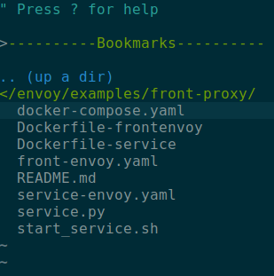

# front proxy分析  
最近在学习envoy，这里简单学习一下其中的入门例子front-proxy.其目录位于envoy/example/front-proxy下。  

## 目录结构
首先看下目录结构，如下所示  

大体上目录中的文件可以分为四个部分：  
* docker compose: docker-compose.yaml  
* docker: Dockerfile-frontenvoy, Dockerfile-service  
* envoy: service-envoy.yaml, front-envoy.yaml  
* source: service.py, start\_service.sh  

接下去分别看下这四个部分的内容  

## docker compose
docker compose是用来配置、管理各个服务的。在本例中，docker compose定义了三个服务，分别是front-envoy, service1和service2.  

front-envoy的dockerfile被指定为Dockerfile-frontenvoy，这样启动docker容器时就会去找到该文件并使用它与docker daemon进行交互。它还将当前目录下的front-envoy.yaml挂载到了docker容器中的/etc中。  

front-envoy还有一个重要的点，它将本地端口80映射到了外界端口8000上，这样外界就可以通过端口8000与其进行交互。而front-envoy则应当监听80端口。  

service1和service2是类似的。以service1为例，它指定了dockerfile为Dockerfile-service，并将当前目录下的service-envoy.yaml挂载到docker容器中的/etc目录下。  

此外，service1的网络还被重命名为service1(为了方便后续配置socket address?),其环境变量SERVICE\_NAME被设置为1以便后面启动。这里的问题是，expose到底有用吗？  
## Docker 
Docker文件是CLI与docker daemon交流的文件，主要是为docker容器的启动作准备。  

Dockerfile-frontenvoy配置了front-envoy服务所在docker容器的属性。它首先指定了base image为envoyproxy/envoy-dev:latest,然后进行更新并安装curl。值得注意的是最后它执行了/usr/local/bin/envoy命令，这应该就是envoy程序的核心所在。  

Dockerfile-service配置了service所在docker容器的属性。它首先指定了base image为envoyproxy/envoy-alpine-dev:latest,然后更新并安装了python3、bash和curl。它创建了/code目录，将service.py添加到了该目录下，并将执行脚本start\_service.sh放到了/usr/local/bin下。最后，它将容器的执行点设置为该脚本。  

## source
源文件包含了服务的业务逻辑。  

start\_service.sh脚本主要干了两件事，一是启动服务service，二是启动envoy。可见，envoy程序必须和业务程序共同启动。此外，之前设置的环境变量在此处也起到了选择service(cluster?)的作用。  

服务程序service.py用到了falsk等框架，我不太了解，因此不详述。这里要说的，服务程序监听的端口号是8080,这个端口号在service-envoy.yaml中被映射到envoy的端口。  

## envoy
最后是envoy的配置文件。这些配置文件在启动envoy程序时被使用。  

在service-envoy中，envoy在80端口上监听，并匹配"/service"前缀的URL，匹配到之后把请求转发给8080端口。  

在front-envoy中，envoy在80端口上监听，并分别匹配"/service/1"和"/service/2"前缀的URL，将请求分别分发给service1的80端口和service2的80端口。  

