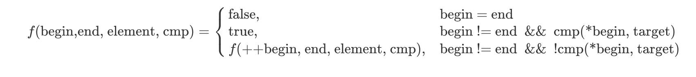

## 0. 引言

我们大多数程序员都知道编程范式，知道面向过程、面向对象（OOP）。大多数人也知道编程范式的下面这个定义：

> 编程范式（Programming paradigm）指的是编程的一种**风格**（Style）。

或者是Wikipedia上的定义（说实话，这个定义并**不准**——我查到的大多数资料都强调编程范式和语言**无关**）：

> 编程范式是一种基于语言的特征来对它们进行分类的方法。

问题是，为什么要有不同的编程范式？为什么现在C++、Java等语言都开始支持越来越多的编程范式？

由于编程范式涵盖许多的方面，在一篇文章里面完整回答上述问题是非常困难的。相对的，这篇文章试图从**抽象**（Abstraction）这个角度来看待多种编程范式的出现。

在软件工程的世界中，抽象是一个非常重要的概念。良好的抽象能帮助程序员写出易维护、清晰简洁的代码。个人认为，对于抽象比较好的定义是：

> 抽象是一种能让你在关注某一概念的同时可以放心地忽略其中一些细节的能力——在不同的层次处理不同的细节。                            
>
> ——《代码大全》

> **模块化与抽象**
>
> 模块化是软件工程里的另一个重要概念，它与抽象这一概念息息相关。实现了良好模块化的代码往往其抽象程度也恰当好处，使得模块之间的调用不用关注具体的细节，并且对一个模块的改动不会轻易影响到另外一个模块。

## 1. 走一步，再走一步—— 面向过程

我们先来看看Wikipedia上对面向过程编程的定义：

> 面向过程是一种基于**过程调用**概念(Concept of the procedure call)，并继承自**结构化编程**（Structured programming）的编程范式。

结构化编程涉及到的内容比较广泛，这里不详细介绍了，简单来说就是通过**选择**(Selection, 即if/then/else)，**重复**(Repetition,即while/for)和**块结构**(block structure，即{}围成的块)来构造结构化控制流的编程方式。现在大多数主流编程语言都有结构化编程的支持。

而面向过程的核心其实是过程调用。最经典的面向过程在C语言中实现。在C语言中，函数就是一个过程。当你调用一个函数的时候，你就是在进行面向过程的编程。

在进行面向过程的编程时，我们将要完成的任务分解成一个个子任务，每一个子任务就是一个过程。我们依次进行过程调用，直到最终完成。

举个例子，假设有个箱子在坐标(0, 0)，我们只能前后左右移动它，一次只能移动一步，现在我们希望它移动到(2, 2)，怎么做？

不面向过程的代码是这样的：

```c
typedef struct Box {
    int x;
    int y;
} Box;
 
int main() {
    Box b;
    b.x = 0;
    b.y = 0;
 
    b.x += 1;
    b.x += 1;
    b.y += 1;
    b.y += 1;
 
    return 0;
}
```

就这个例子来说，它干的还可以。但是这样的写法把所有的细节都放在一个函数里，而我们写代码、看代码的时候需要关注的不再是任务背后的概念（箱子往上移动，再往右移动），而是实现任务的细节（修改箱子的坐标）。

我们来看面向过程的代码：

```c
typedef struct Box {
    int x;
    int y;
} Box;
void move_from_0_0_to_2_2(Box *b) {
    front(b);
    front(b);
    right(b);
    right(b);
}
void front(Box *b) {
    b->y += 1;
}
void right(Box *b) {
    b->x += 1;
}
void initialize_box(Box *b) {
    b->x = 0;
    b->y = 0;
}
int main() {
    Box b;
    initialize_box(&b);
    move_from_0_0_to_2_2(&b);
}
```

这里把整个任务分成两个过程：初始化和移动。接着把移动分为两个过程：向前走一步，再走一步。然后向右走一步，再向右走一步，即达到目标。

这就是面向过程的思想：**一步一步完成各个子过程，直到完成总体任务**。

> **名字的重要性**
>
> 从上面的例子中可以看出名字的作用。在编程中名字的重要性已经被强调了很多次，《代码大全》甚至手把手教我们如何命名。为什么名字如此重要？因为每个名字代表了一个概念的抽象，使我们可以忽略名字后面的细节。一个坏名字破坏了这种抽象，使我们不得不关注实现细节——甚至在看细节的时候也会受到坏名字的影响。

那么，从抽象的角度看，面向过程表现的如何呢？

要回答这个问题，我们先要知道一个著名的公式（虽然可能时至今日已经不太准确了）：

>**Algorithms + Data Structures = Programs**

Algorithms，算法，其实就是解决一个问题的过程。而面向过程的编程范式所干的事情，就是把一个大算法分解为一个个小算法。当分解为这些小算法之后，我们只需要关心这些小算法各自是怎么实现的。从这个角度上看，面向过程实现了**算法的抽象**——我们在大算法中不再关心整个算法的细节，而是关心小算法背后的概念，然后把这些算法组合起来完成总体的任务。

然而，面向过程没有解决的是另一个部分——数据结构。

我们考虑子过程之间的接口。由于面向过程忽视数据结构，因此各个子过程之间传递的数据结构通常是个简单的结构体。当我们拿到一个结构体，我们必须知道这个结构体里包含了哪些数据，然后再针对这些数据进行操作(也就是说，**接口其实由数据构成，而不是数据背后的概念**）。比如上面的Box，当我们拿到Box，其实我们关心的是Box能怎么移动，然而实现时却需要取出坐标，然后再对坐标进行操作。

更具体的说，面向过程的编程范式不包含**封装**(Encapsulation)这一特性。不能进行封装也就意味着很难做到良好的数据隐藏，

在这样的背景下，面向对象的编程范式就出现了。

## 2. 谁还没个对象——面向对象

在如今这个没有对象就会被阴阳怪气的时代，相信大家都面向对象都不陌生。面向对象的编程范式主张把程序的基本单元从过程变为对象，而有些编程语言（Java）更是干的十分彻底，把一切都变为了对象。

从抽象的角度看，面向对象是对面向过程的改进。大家都知道封装、继承、多态是面向对象的三大特性，而这三者都和抽象息息相关。

封装的实现需要两个条件：

- 访问控制，也就是控制对象里的数据是否能被外部访问
- 方法，也就是表明这个对象能进行什么操作

这样，我们同时实现了对数据结构和过程的抽象。我们拿到一个对象时，我们关心的是对象背后的概念——这通过调用方法来实现，而这个对象里面有哪些数据，是怎么实现的，我们并不关心。

我们还是举面向过程中的例子来实现代码，如下所示：

```java
public class Box {
    private int x;
    private int y;
 
    public Box() {
        x = 0;
        y = 0;
    }
     
    public void front() {
        y += 1;
    }
 
    public void right() {
        x += 1;
    }
}
 
public class MoveBox {
    public static void main(String[] args) {
        Box box = new Box();
        move_from_0_0_to_2_2(Box box);
    }
 
    private void move_from_0_0_to_2_2(Box box) {
        box.front();
        box.front();
        box.right();
        box.right();
    }
}
```

看上去这个实现和面向过程中的实现差不多，无非就是函数换了个地方而已，但思想上却很不一样。

假设Box是已经写好的结构体/类，我们在写move_from_0_0_to_2_2这个方法。我们很自然就会想到要分为两个过程，先向前，再向右。

- 在面向过程里，为了达到这两个目的，我们会先去查看Box包含了哪些数据，然后再区分两个过程，对这些数据进行处理。
- 在面向对象里，为了达到这两个目的，我们会去查看Box包含了哪些方法，然后可以的话调用这些方法进行处理。

显然，一个需要关心数据，而另一个不需要。

有的同学会觉得，在面向过程的范式里，针对一个结构体定义一堆过程不就可以达到同样的效果吗？确实如此，但问题在于：即使定义了一堆过程，也没法保证使用结构体的人只使用你定义的过程，毕竟结构体不包含封装，数据都是公开的。最重要的是，由于数据是公开的，它**隐式地鼓励了程序员在收到结构体作为参数时自由地对其中的参数进行修改**——毕竟大多数程序员都不喜欢束缚，喜欢自由。

再后来，人们发现仅仅用对象来表示概念还不够。我有Box，我还有Car，还有Cat，这些都能移动，我总不能给每种对象都写一遍一样的代码吧（注意，这里有点**泛型**的意思）？咋办呢？于是就诞生了**虚基类（C++）/接口（Java）**的概念**。**

不管是虚基类还是接口，其实表达的都是某个概念，而具备了这个概念的对象就可以执行某些动作。

例如Box可以有Moveable的接口：

```java
interface Moveable {
    void front();
    void right();
}
 
 
public class Box implements Moveable {
      ...
}
 
 
public class Move {
   ...
    private void move_from_0_0_to_2_2(Moveable moveable) {
        ...
    }
}
```

OK，这样，我们终于不再关心对象的细节，而是关心于对象背后的概念。

> **多态与泛型**
>
> 继承和多态其实是**面向对象的泛型**。我们写一个接收基类参数的方法，然后往里传入子类，这样，这个方法就能接收继承了基类的各个子类，从而使得这个方法更为通用——而这就是泛型的本质。

## 3. 我不是针对谁，我是说在座的各位——泛型

面向对象用对象同时抽象了数据结构与算法，看上去一切都很美妙。然而果真如此吗？很遗憾，面向对象没有抽象掉的是它赖以生存的东西——类型。

### 3.1 类型与抽象

每一门编程语言中都必定包含着一套类型系统，因为编程世界中的数据其实是由两部分组成：**结构 & 类型**。而我们之前抽象掉了数据结构，却忽略了类型。

本质上，类型的存在本身就是一种抽象，它抽象的是底层的内存布局。当我们说int类型，我们知道它是个整数，至于具体是4个字节还是8个字节，交给编译器去关心就行了。

从这个角度看，类型无疑是对我们有帮助的。然而一切事物都是具有两面性的，它也带来了问题，那就是当我们编写一个算法时，我们不得不关心我们要处理的数据其类型是什么。如果我们要写一个对任何类型通用的算法（即所谓泛型算法），我们怎么抽象掉类型，而只关心算法本身的逻辑流程？

先举个简单的概念上的例子，比如上面的Box。假设Box里面装的是个惊喜礼物Suprise，到达终点后会拆开。但是里面具体是什么是不确定的，可能是口红，可能是包。如果用面向对象的方法，我们必须要给每个概念找到一个对应的类型。

```java
interface Suprise {
}
 
class Lipstick implements Suprise {
}
 
 
class Money implements Suprise {
}
 
class Box {
    ....
    private Suprise suprise;
    public void setSuprise(Suprise suprise) {
        this.suprise = suprise;
    }
    public Suprise getSuprise() {
        return suprise;
    }
}
```

这样写的问题在于，我们设置和获取的都是个接口Suprise，问题是这个Suprise是啥呢？即使取出了，我们也不知道。

> **RTTI、类型转换与泛型**
>
> **RTTI, 即RunTime Type Information**，指的是在运行时获取对象的类型信息，反射就是RTTI的一种。
>
> **类型转换**指的是对象的类型在编译器的允许之下可以进行改变。静态类型语言(C++、Java等)通常需要显式进行类型转换，动态类型语言(Python、JS等)则可以自动进行
>
> 类型转换其实就是一种**低层次的泛型**，它配合RTTI可以一定程度上缓解泛型算法的问题，但这样的解法往往引入额外的复杂性，因此并不优雅。

### 3.2 例子——搜索

接下去，我们用泛型中最经典的搜索来举个例子，下面是伪代码：

```
bool search(Array array, Target target) {
    for (element in array) {
        if (element equals target) {
            return true;
        }
    }
    return false;
}
```

我们希望，这个算法可以对所有类型都有效，也就是Target不管是啥类型，这个算法都可以正常运行。

怎么办呢？如果Target是int类型，那么C语言的实现很简单：

```c
bool search(int[] array, int size, int target) {
    int i = 0;
    for (; i < size; i++) {
        if (array[i] == target) {
            return true;
        }
    }
    return false;
}
```

可是对于double、char等类型该怎么办呢？更别说还有自建的类型。每种类型都实现一次方法显然是很ugly的，也不易于维护。

为了解决这个问题，不同的语言采取了不同的方法。

### 3.3 C的泛型

C语言最重要的设计理念之一就是程序员具有控制底层行为的权利，因此C语言的泛型并没有往上层抽象，而是往下走。

对于C语言来说，一切类型都不过是内存布局，一块内存又可以用void *来表示，所以void *就是C泛型的主旋律。

```c
bool search(void *array, int arr_size, int element_size, void *target) {
    int i = 0;
    for (; i < arr_size; i++) {
        if ((memcmp((unsigned char *)array + element_size * i, target, element_size)) == 0) {
            return true;
        }
    }
    return false;
}
```

上面这段代码对于基本类型来说是没问题的，然而如果要比较的是个结构体，其中又包含指针，这段代码就变成了比较指针而不是指针所指向的内容了。要彻底解决这个问题，会涉及到函数式的一点内容，后面我们再看。

C语言的泛型十分难用，一方面这是因为函数调用方需要知道很多信息，从而造成了负担。另一方面，C语言的泛型都是直接在内存上进行操作，非常危险，一旦错了一个字节就会崩溃。

### 3.4 C++的泛型

C++利用模板template实现了泛型。

在C++中，一个模板指的是一份生成代码的蓝图。当我们定义了一个模板，并且使用该模板时，编译器在编译代码时会依据我们使用模板时传入的类型来生成一份代码。如果在模板代码中错误使用了模板参数，那就会在编译时报错。

```c++
template<typename Iter, typename Element>
bool search(Iter begin, Iter end, Element target) {
    Iter iter = begin;
    for (; iter != end; iter++) {
        if (*iter == target) {
            return true;
        }
    }
    return false;
}
```

在其中：

- Iter指的是迭代器的概念
- Element指的是容器中元素的概念

这段代码和伪代码的实现几乎一样，这是因为伪代码中的类型全部用模板类型抽象了。当我们在写泛型算法的时候，对于要用到的抽象类型直接用模板类型代替，然后专注于算法本身的逻辑（即伪代码）就可以了。

### 3.5 Java的泛型

Java的泛型是被人诟病的伪泛型。它其实是依赖**类型擦除**实现的泛型，其实也就是上面说的类型转换。

Java的泛型Search实现和C++很像：

```java
public class Search {
    public <T> boolean search(Iterator<T> begin,  T target) {
        Iterator<T> iter = begin;
        while(iter.hasNext()) {
            T element = iter.next();
            if (element.equals(target)) {
                return true;
            }
        }
        return false;
    }
}
```

我们关注下其中对象的相等性比较。在C++的泛型中，我们用==来表示“相等”这一概念。如果我们实际传入的类型没有实现==，那么代码会报错。如果实现了==，那么代码不会报错。

而在Java的泛型中，这段代码之所以会编译通过是因为Object对象帮我们实现了默认的equals方法，而T类型会被擦除成Object类型。

假如我们现在不想用==符号和equals方法来比较对象的相等性，想统一用一个叫做isSameAs的方法来比较。在C++的泛型里，我们直接修改==即可。然而在Java里，由于Object没有这个方法，所以代码是永远无法通过编译的——即使我们的对象类型实现了该方法并传入也不行。

## 4. 世间万物皆系于公式之上——函数式

OK，现在我们已经到达了抽象的一个比较高的高度，我们先进行个简单的梳理：

1. 首先，我们发现所有细节都堆积在一个地方，所以用面向过程抽象了完成任务的各个步骤，也就是子过程（函数）
2. 接着，我们发现过程之间通信的接口暴露了数据，使得我们不得不关注它们，所以用面向对象抽象了数据
3. 然后，我们发现每个对象都必须要有个类型，在写某个方法时必须要关注类型，所以用泛型抽象了类型

在使用泛型来对数据进行抽象之后，由于数据的类型和结构都已经转化为数据对应的概念，因此对数据的抽象已经很难继续了。然而对过程（也就是算法），还可以进行更高层次的抽象，那就是函数式编程。

### 4.1 简单示例

我们回到泛型中C语言的例子。C语言的search函数其实是有问题的，因为用memcmp比较只比较了内存的内容，而没有比较内存中可能存在的指针指向的内容，因此我们需要传给函数一个比较函数。

```c
bool search(void *array, int arr_size, int element_size, void *target， (int)(*cmp)(void *, void *, int) {
    int i = 0;
    for (; i < arr_size; i++) {
        if ((cmp((unsigned char *)array + element_size * i, target, element_size)) == 0) {
            return true;
        }
    }
    return false;
}
```

而调用这个函数时，我们就需要自定义一个比较函数传给它。

这就是函数式编程的一个基本概念：函数可以当作参数来传递和返回。

函数式编程和泛型结合可以非常使我们写出抽象程度很高的代码。例如C++中的search版本：

```c++
template<typename Iter, typename Element, typename Cmp>
bool search(Iter begin, Iter end, Element target, Cmp cmp) {
    for (Iter iter = begin; iter != end; iter++) {
        if (cmp(*iter, target)) {
            return true;
        }
    }
    return false;
}
```

在这里，相等性比较的==操作符被更为抽象的Cmp模板所代替。

### 4.2 声明式编程

让我们再仔细看看上面这段代码。

我们知道，搜索的本质其实就是**遍历容器，比较元素**。在上面的代码中，我们用Cmp函数抽象了“比较元素”这一操作，但是对于“遍历容器”却没有处理。

通常，遍历这个操作有两种方法：迭代和递归。迭代更偏向于一种**指令式**的方案，我们利用for、while告诉计算机从容器的起始开始往前走，每经过一个元素就进行对应的操作，直到结束——无论是通过break还是return。而递归则更偏向于是一种**声明式**的方案，我们每一次都让计算机调用下一个函数，并且只有在递归的结束条件才关心要做什么。

```c++
template<typename Iter, typename Element, typename Cmp>
bool search(Iter begin, Iter end, Element target, Cmp cmp) {
    return begin == end ? false : (cmp(*begin, target) ? true : search(++begin, end, target, cmp));
}
```

让我们用形式化的数学公式来表示上面这个过程：



在有了这个公式之后，我们使用一些纯函数式语言写起代码来就会非常顺手，比如用Scheme(伪代码）：

```lisp
(define (search begin end element cmp)
  (cond ((=  begin end) 0)
        ((cmp *begin target) 1)
        (else (search (+ begin 1) end element cmp))))
```

